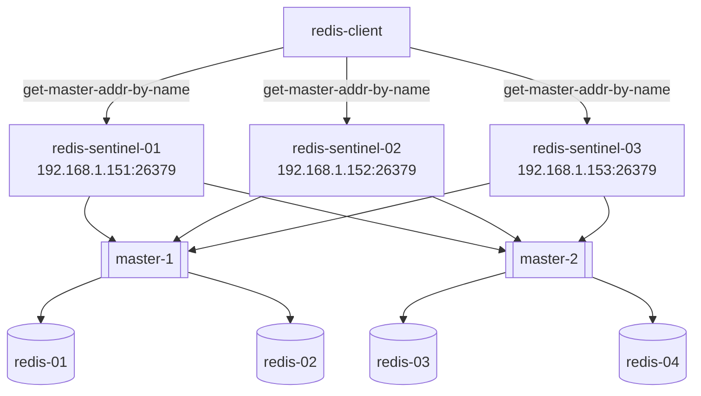

# redis
all setup related to redis and redis HA
# REDIS HA
## sentinel



Redis replica could be configure to enable High Availability from redis instance with feature of manual master FAILOVER. But for automatic master switching, replica auto-dicovery and many other distributed features of redis sentinel, we are using 3 redis sentinel instance to create HA for redis.
Here, core configuration related to HA is as shown below:

```
sentinel monitor master-1 192.168.1.201 6379 2
sentinel down-after-milliseconds master-1 2000
sentinel failover-timeout master-1 10000
sentinel parallel-syncs master-1 1
 
sentinel monitor master-2 192.168.1.202 6379 2
sentinel down-after-milliseconds master-2 2000
sentinel failover-timeout master-2 10000
sentinel parallel-syncs master-2 1
```

General syntax of sentinel

sentinel <option_name> <master_name> <optaion_value>

Interpretation of configuration

    sentinel monitor master-1 192.168.1.201 6379 2

monitor redis instance 192.168.1.201:6379 as master-1 with master being recognized by at least two sentinel instances. Here, 2 is a quorum needed for consensus.

    sentinel down-after-milliseconds master-1 2000

consider the master to be down if no reply follows for 2000 ms.

    sentinel failover-timeout master-1 10000

Redis instance proceed master failover one by one. It the time after which another redis instance failover the master and rewrite the configuration.

    sentinel parallel-syncs master-1 1

No. of replica configure in parallel after master failover

Some of the key states check from  sentinel are

    +reset-master <instance details> -- The master was reset.
    +slave <instance details> -- A new slave was detected and attached.
    +failover-state-reconf-slaves <instance details> -- Failover state changed to reconf-slaves state.
    +failover-detected <instance details> -- A failover started by another Sentinel or any other external entity was detected (An attached slave turned into a master).
    +slave-reconf-sent <instance details> -- The leader sentinel sent the SLAVEOF command to this instance in order to reconfigure it for the new slave.
    +slave-reconf-inprog <instance details> -- The slave being reconfigured showed to be a slave of the new master ip:port pair, but the synchronization process is not yet complete.
    +slave-reconf-done <instance details> -- The slave is now synchronized with the new master.
    -dup-sentinel <instance details> -- One or more sentinels for the specified master were removed as duplicated (this happens for instance when a Sentinel instance is restarted).
    +sentinel <instance details> -- A new sentinel for this master was detected and attached.
    +sdown <instance details> -- The specified instance is now in Subjectively Down state.
    -sdown <instance details> -- The specified instance is no longer in Subjectively Down state.
    +odown <instance details> -- The specified instance is now in Objectively Down state.
    -odown <instance details> -- The specified instance is no longer in Objectively Down state.
    +new-epoch <instance details> -- The current epoch was updated.
    +try-failover <instance details> -- New failover in progress, waiting to be elected by the majority.
    +elected-leader <instance details> -- Won the election for the specified epoch, can do the failover.
    +failover-state-select-slave <instance details> -- New failover state is select-slave: we are trying to find a suitable slave for promotion.
    no-good-slave <instance details> -- There is no good slave to promote. Currently we'll try after some time, but probably this will change and the state machine will abort the failover at all in this case.
    selected-slave <instance details> -- We found the specified good slave to promote.
    failover-state-send-slaveof-noone <instance details> -- We are trynig to reconfigure the promoted slave as master, waiting for it to switch.
    failover-end-for-timeout <instance details> -- The failover terminated for timeout, slaves will eventually be configured to replicate with the new master anyway.
    failover-end <instance details> -- The failover terminated with success. All the slaves appears to be reconfigured to replicate with the new master.
    switch-master <master name> <oldip> <oldport> <newip> <newport> -- The master new IP and address is the specified one after a configuration change. This is the message most external users are interested in.
    +tilt -- Tilt mode entered.
    -tilt -- Tilt mode exited.

Sentinel Commands
- PING This command simply returns PONG.
- SENTINEL masters Show a list of monitored masters and their state.
- SENTINEL master <master name> Show the state and info of the specified master.
- SENTINEL slaves <master name> Show a list of slaves for this master, and their state.
- SENTINEL get-master-addr-by-name <master name> Return the ip and port number of the master with that name. If a failover is in progress or terminated successfully for this master it returns the address and port of the promoted slave.
- SENTINEL reset <pattern> This command will reset all the masters with matching name. The pattern argument is a glob-style pattern. The reset process clears any previous state in a master (including a failover in progress), and removes every slave and sentinel already discovered and associated with the master.
- SENTINEL failover <master name> Force a failover as if the master was not reachable, and without asking for agreement to other Sentinels (however a new version of the configuration will be published so that the other Sentinels will update their configurations).

## redis client
Now, redis client need to make connection with redis-sentinels asking current redis master for redis connection.
Example:
To get address to current master for master-1 with redis-cli in bash
```
redis-cli -h redis-redis-sentinel-001 -p 26379 sentinel get-master-addr-by-name master-1`
```
**output:**
```
1) "192.168.1.201"
2) "6379"
```


